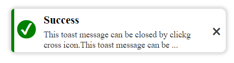
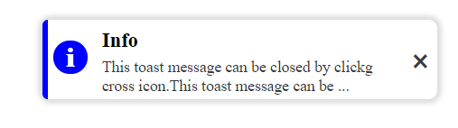
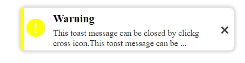

# toaster notification
<pre>
<code>
showNotification({
  title: 'notification title',
  msg: 'notification content',
  type: 'success', // options-> success, info, warning,
  duration: (time in ms), // optional if you want notification to fade in given time,
                          // by default notification will stay until closed by user.
});
</code>
</pre>
### success 

### Info 

### warning 

